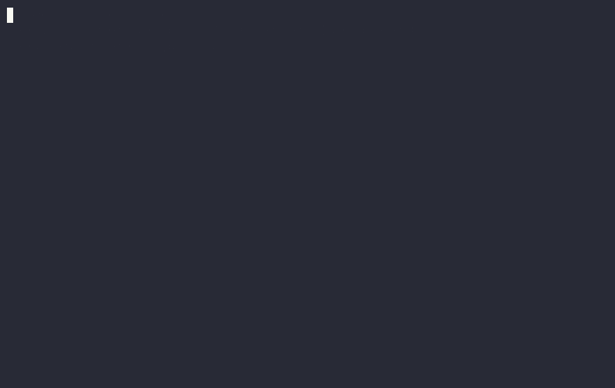

# 🛡 AgentVault

**A runtime permission firewall for AI agents.** Wrap any agent — Claude Code, OpenCode, OpenClaw, a shell script, anything — in declarative YAML rules, popup/phone approvals, and a tamper-evident audit log of everything it did.

```bash
agentvault run -- opencode
```



> ⚠️ **Scope, honestly.** On macOS the agent runs under a **kernel sandbox** (Seatbelt) generated from your policy — direct `/bin/rm` calls and raw sockets are blocked at the syscall layer. On Linux/Windows today: shims + proxies + tamper-evident audit (kernel backends are the v0.3 roadmap). Details: [SECURITY.md](SECURITY.md).

## Why

AI agents run with your shell, your files, your API keys. AgentVault answers: *what is the agent doing — and what is it allowed to do?*

- **Deny by default** — credentials, `rm -rf`, unknown egress blocked unless you say otherwise
- **One-tap approvals** — dangerous actions pop a native macOS dialog, page your phone (Telegram), or ask on the terminal — each showing *what* the agent wants and *what could go wrong*; approve once or approve the rule
- **Tamper-evident audit** — every action hash-chained in local SQLite, Ed25519-signed at session close; `agentvault verify` catches any tampering
- **Single static binary** — no daemons required, no cloud, no telemetry

## Install

```bash
curl -fsSL https://agentvault.dev/install.sh | sh   # checksum-verified
agentvault init                                      # writes policy, installs shims
```

Or from source: `go build ./cmd/agentvault`.

## 60-second tour

```bash
agentvault policy check          # validate your rules
agentvault run -- bash           # wrap a shell
# inside:  rm -rf /tmp/x  → blocked (exit 126), you're told which rule
#          git push       → your phone pings: [Allow once] [Allow rule] [Deny]
agentvault log                   # live TUI: every action, verdict, rule, latency
agentvault verify                # prove nobody edited the log
```

Four channels are covered: **MCP tool calls** (stdio proxy), **shell commands** (PATH shims), **network egress** (CONNECT proxy), and **filesystem** (via the first two). Details: [docs/SPEC.md](docs/SPEC.md).

## Policy example

```yaml
version: 1
defaults: {action: deny}
rules:
  - name: protect-credentials
    match: {action: [fs.read, fs.write, fs.delete], path: ["~/.ssh/**", "~/.aws/**"]}
    effect: deny
  - name: git-push-ask
    match: {action: [shell.exec], cel: 'event.cmd == "git" && event.argv[1] == "push"'}
    effect: require_approval
```

More: [agentvault.example.yaml](agentvault.example.yaml) · Integrations: [Claude Code](docs/integrations/claude.md) · [OpenCode](docs/integrations/opencode.md) · [OpenClaw](docs/integrations/openclaw.md)

## Status

Weeks 1–7 of the [8-week roadmap](docs/SPEC.md) complete. All platforms: macOS (arm64/amd64), Linux (arm64/amd64), Windows (arm64/amd64). Windows notes: `.cmd` shims, loopback-TCP IPC with session tokens, Interrupt-only signals.

## License

Apache-2.0
