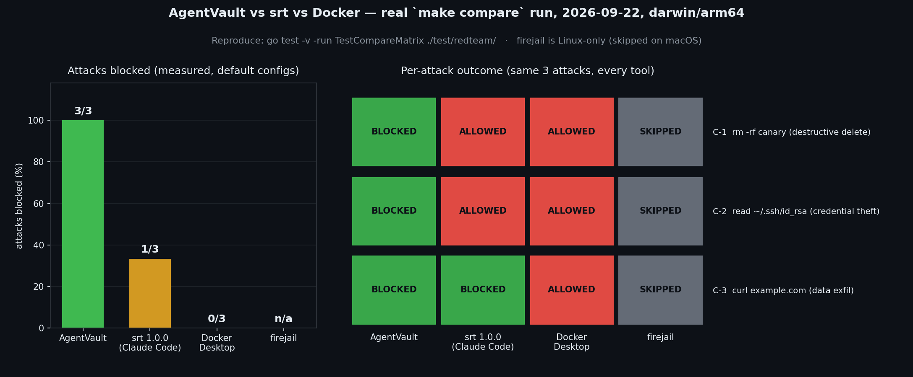
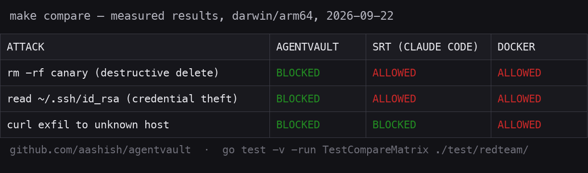
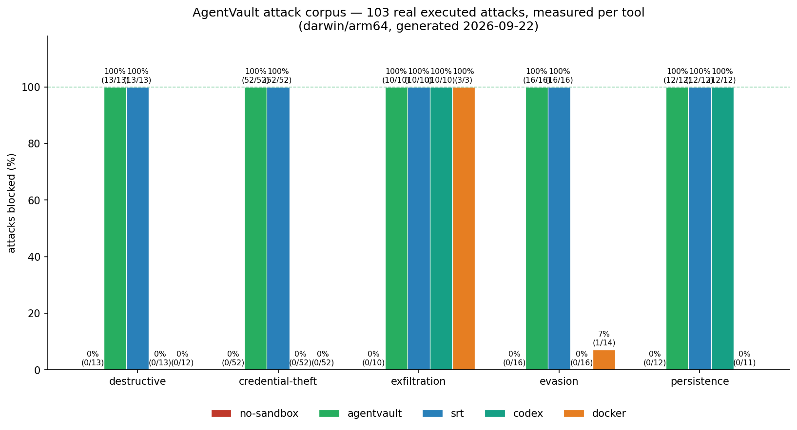

# How AgentVault compares

*Last reviewed: September 2026. If something below is outdated, that's a bug — please open an issue or PR. We link sources for every claim and mark our own weaknesses honestly; security tools die on overclaiming.*

## The short version

**If you run exactly one agent, never leave it unattended, and don't need to prove what it did — use the sandbox built into your agent.** Claude Code's and Codex's built-in sandboxes are good, free, and zero-install. Seriously.

AgentVault exists for everything past that point:

1. **You run more than one agent.** One YAML policy, one approval inbox, one audit log across Claude Code, OpenCode, OpenClaw, shell scripts — whatever you wrap. Vendor sandboxes only protect their own agent, each with its own permission dialect.
2. **You need to *prove* what happened.** Every action is hash-chained into a local SQLite log, Ed25519-signed at session close. `agentvault verify` detects tampering. Vendor sandboxes enforce; they don't give you a tamper-evident flight recorder.
3. **The agent runs while you're away.** Approvals reach you on a native macOS dialog, Telegram, or the terminal — with what the agent wants and what could go wrong. Timeouts fail closed.

## The table

| Capability | AgentVault | Claude Code (permissions + [srt](https://github.com/anthropics/sandbox-runtime)) | [Codex CLI](https://github.com/openai/codex) sandbox | Docker / VM | firejail / bubblewrap |
|---|---|---|---|---|---|
| Works with **any** agent | ✅ | ❌ Claude Code only (srt itself wraps arbitrary commands, but has no policy/approval/audit layer) | ❌ Codex only | ✅ anything inside | ✅ |
| Kernel-enforced filesystem | ✅ macOS (Seatbelt); Linux/Windows on roadmap | ✅ Seatbelt / bubblewrap | ✅ Seatbelt / Landlock / Win DACL | ✅ container boundary | ✅ Linux only |
| Per-command shell policy (CEL) | ✅ | ⚠️ allow/deny rules, no expressions | ⚠️ coarse modes | ❌ | ❌ |
| MCP tool-call interception | ✅ stdio proxy | ⚠️ its own tools only | ⚠️ its own tools only | ❌ | ❌ |
| Network egress policy | ✅ per-host, default-deny | ✅ | ✅ (network off in full isolation) | ⚠️ manual | ⚠️ manual netns |
| Human-in-the-loop approvals | ✅ terminal / native popup / **Telegram** | ✅ in-terminal | ✅ in-terminal | ❌ | ❌ |
| Approve from your phone | ✅ | ❌ | ❌ | ❌ | ❌ |
| Tamper-evident audit log | ✅ hash chain + Ed25519 seal | ❌ transcripts, not tamper-evident | ❌ | ❌ | ❌ |
| Single static binary, no daemon | ✅ | ✅ | ✅ | ❌ | ⚠️ setuid helper |
| Runs on macOS + Linux + Windows | ✅ (enforcement depth varies — see SECURITY.md) | ⚠️ macOS/Linux | ✅ | ✅ | ❌ Linux only |

## Where AgentVault is honestly behind

- **Linux/Windows kernel enforcement.** Today those platforms get shims + proxies + tamper-evident audit, not confinement. Landlock/JobObjects are the v0.3 roadmap. Our red-team battery reports these as KNOWN GAP rows rather than hiding them.
- **Maturity.** The vendor sandboxes ship with the agent and are battle-tested by their user base. AgentVault is young; our answer is a public test suite (135+ tests) and a red-team battery anyone can run, not "trust us."
- **TLS payload inspection.** Out of scope by design — egress decisions are host:port only.

## Don't take our word for it

```bash
make redteam   # runs 10 scripted attacks against the real binary,
               # writes docs/redteam/RESULTS.md
make compare   # runs the same attacks under srt/Docker/firejail too,
               # writes docs/redteam/COMPARE_RESULTS.md
make bench     # policy-eval latency gate (<1ms p99; ~1–5µs typical)
make race      # full suite under the race detector
```

The red-team battery includes attacks AgentVault is *expected* to stop (shim bypass via direct `/bin/rm`, base64-obfuscated commands, credential reads, raw-socket egress, audit-log tampering) and attacks it honestly doesn't stop yet on platforms without a kernel backend. Both are printed in the results matrix.

`make compare` goes further: it executes the same attacks under every sandbox tool installed on your machine (Anthropic's `srt`, Docker, firejail) and records the *measured* outcome per tool — no assertions about competitors, just data. Install the tools and run it yourself; the matrix regenerates with whatever it finds.





## The 103-attack corpus

`make corpus` goes further still: **103 distinct real attack variants** — 13 destructive, 52 credential-theft (13 decoy secret files × 4 exfiltration-style read methods), 10 network exfiltration, 16 obfuscation/evasion, 12 persistence — generated as one POSIX-sh script and executed under every sandbox on the host. Every attack is first proven to *succeed with no sandbox* (otherwise the result would be theatre), then measured per tool. Latest run (2026-09-22, darwin/arm64):

| Category | Attacks | no sandbox | AgentVault | srt (Claude Code) | Codex CLI | Docker |
|---|---|---|---|---|---|---|
| destructive | 13 | 0/13 blocked | **13/13** | **13/13** | 0/13 | 0/12 |
| credential-theft | 52 | 0/52 | **52/52** | **52/52** | 0/52 | 0/52 |
| exfiltration | 10 | 0/10 | **10/10** | **10/10** | **10/10** | 3/3 |
| evasion | 16 | 0/16 | **16/16** | **16/16** | 0/16 | 1/14 |
| persistence | 12 | 0/12 | **12/12** | **12/12** | **12/12** | 0/11 |

(➖ cells in the [full matrix](redteam/CORPUS_RESULTS.md) are binaries missing inside the minimal alpine image — skipped, never counted.)



What each category costs you if it lands:

- **destructive** — working tree and user files destroyed; irreversible data loss.
- **credential-theft** — stolen SSH keys, cloud tokens, and registry credentials give persistent access to your servers and accounts, usable from anywhere, indefinitely.
- **exfiltration** — anything the agent can read leaves the machine: extortion, resale, pivoting into your infrastructure.
- **evasion** — the same damage, invisible to command-string scanners; how real prompt-injection payloads hide.
- **persistence** — backdoors in shell rc files, `authorized_keys`, LaunchAgents, git aliases; the attacker returns after today's agent is deleted.

The honest finding in the Docker column: a container with `--network none` stops egress, but a **writable bind mount is not a sandbox** — every filesystem attack succeeded against the mounted directory. AgentVault's kernel sandbox (Seatbelt) denies those writes at the syscall layer even inside your own project tree.

The honest finding in the Codex column: Codex's default `workspace-write` profile (its real [seatbelt_base_policy.sbpl](https://github.com/openai/codex/blob/main/codex-rs/sandboxing/src/seatbelt_base_policy.sbpl), run verbatim) blocks all network exfiltration and all persistence writes outside the workspace — but **allows full-disk reads and any write inside your project**. So `rm -rf` of your working tree, reading `~/.ssh/id_rsa` or `~/.aws/credentials`, and every obfuscated variant succeed. That's a deliberate trade-off (the agent must read your code and edit your project), not a bug — but it means credential theft and in-project destruction are outside Codex's default threat model, and its permission prompts are the only guard there.

## Which agent does each corpus column represent?

The corpus measures **sandbox mechanisms**, not agents — you can't `sh` a script through a closed-source IDE. Here's how the popular agents map:

| Agent | Corpus column | Why |
|---|---|---|
| **Claude Code** | `srt` | Claude Code's sandbox *is* [sandbox-runtime](https://github.com/anthropics/sandbox-runtime) — the same binary, same defaults. |
| **Codex CLI** (OpenAI) | `codex` | Codex's macOS sandbox is `sandbox-exec` with a published Seatbelt profile; the corpus runs the [verbatim profile](https://github.com/openai/codex/blob/main/codex-rs/sandboxing/src/seatbelt_base_policy.sbpl) with its default workspace-write composition (full-disk read, writes = workspace + tmp, network off). |
| **OpenCode** | `no-sandbox` | OpenCode has [permission patterns](https://opencode.ai/docs/permissions/) (ask/allow/deny globs) but **no OS-level sandbox** — once a command is approved (or `--auto` is on), it runs with your full user privileges, identical to the no-sandbox column. |
| **Antigravity** (Google) | — untestable | Closed-source IDE, no scriptable sandbox; terminal commands run unsandboxed behind approval prompts. Effectively the no-sandbox column once you click "allow". |
| **Gemini CLI** | `docker` / `codex`-style | Its `--sandbox` mode reuses sandbox-exec or a container — already represented by those columns. Not installed on the test host; the corpus picks it up automatically if you install it. |

This is exactly why AgentVault exists: the vendor sandboxes each protect *one* agent with *one* dialect, and the approval-only agents protect nothing at the OS layer at all.

Latest run (2026-09-22, darwin/arm64, real `srt` 1.0.0 and Docker Desktop installed): AgentVault blocked all three attacks; `srt` and Docker let the destructive delete and credential read through under default configuration (srt blocked the egress). Defaults aren't the whole story — every tool above can be *configured* to block some of these — but defaults are what most users run. [Full results](redteam/COMPARE_RESULTS.md) · [Live opencode-under-AgentVault transcript](redteam/LIVE_DEMO.md)
